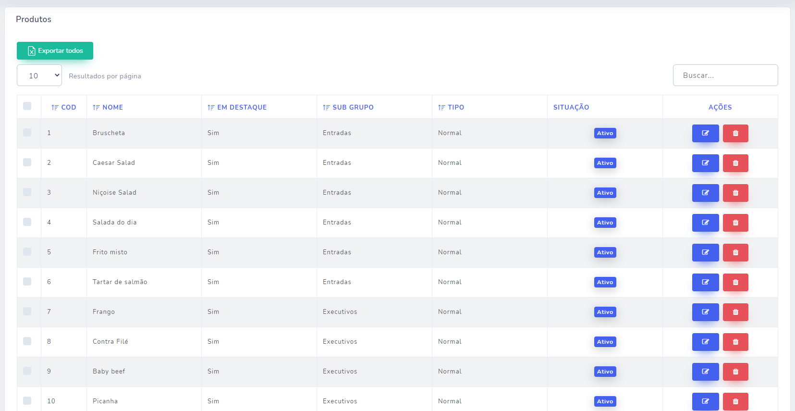

# Livewire DataTables

A [Laravel Livewire](https://laravel-livewire.com) table component with searching, sorting, checkboxes, pagination and export data.

With the component you can quickly generate a table from an entity or a collection.

Bootstrap version - Product Model


Tailwind version - User Model


Exported example with selected data


[See these other examples!](examples)

- [Support](https://github.com/luanfreitasdev/livewire-datatable/issues)
- [Contributions](https://github.com/luanfreitasdev/livewire-datatable/pulls)

---
# Installation

Installing this package via composer:

```bash
    composer require luanfreitasdev/livewire-datatable
```

Add Providers

```php
    'providers' => [        
        LuanFreitasDev\LivewireDataTables\Providers\DataTableServiceProvider::class        
    ];
```

Be sure to enter livewire policies

```html
    @livewireStyle and @livewireScripts
```

You can use either tailwind or bootstrap

[Install Tailwindcss](https://tailwindcss.com/docs/guides/laravel)

[Bootstrap 5](https://getbootstrap.com/docs/5.0/getting-started/introduction/)

---
# Making Table Components

Component generated for an entity

Using the `make` command:

* To create from a model

```bash
    php artisan make:table --name=ProductTable --model=App\Models\Product
```

* To create from a collection (ignore --model)

```bash
    php artisan make:table --name=ProductTable
```

### Options

| Option | Description | Example | 
|----|----|----|
|**--name**| Model name | ```--name=ProductTable``` |
|**--model**| Full model path | ```--model=App\Models\Product``` |
|**--publish**| Publish stubs file into the path 'stubs' | ```--publish``` |
|**--template**| Sometimes you can use ready-made templates for creating different types of tables | ```php artisan make:table --template=stubs/table.sub or php artisan make:table --template=stubs/table_with_buttons.sub``` |

This creates your new table component in the `app/Http/Livewire` folder.

---

### Column Methods

| Method | Arguments | Result | Example |
|----|----|----|----|
|**add**| |Add new column |```Column::add()```|
|**title**| *String* $title |Column title representing a field |```add()->title('Name')```|
|**field**| *String* $field | Field name| ```->field('name')```|
|**searchable**| |Includes the column in the global search | ```->searchable()``` |
|**sortable**| |Includes column in the sortable list | ```->sortable()``` |
|**headerAttribute**|[*String* $class default: ''], [*String* $style default: '']|Add the class and style elements to the column header|```->headerAttribute('text-center', 'color:red')```|
|**bodyAttribute**|[*String* $class default: ''], [*String* $style default: '']|Add the column lines the class and style elements|```->bodyAttribute('text-center', 'color:red')```|
|**html**| |When the field has any changes within the scope using Collection|```->html()```|
|**visibleInExport**| |When true it will be invisible in the table and will show the column in the exported file|```->visibleInExport(true)```|
|**filterDateBetween**| [*String* $class default: 'col-3'] |Include a specific field on the page to filter between the specific date in the column|```Column::add()->filterDateBetween()```|
---


### Action Methods

Coming soon

---

### Filters

To use a filter, you must declare the ```@datatableFilter``` directive before </body>

---

# Using Table Components

After making a component, you may want to edit the `setUp`, `dataSource`, `columns` and `actions` methods:

```php
    class ProductTable extends DataTableComponent
    {
        use ActionButton;

        public function setUp()
        {
            $this->showCheckBox()
                ->showPerPage()
                ->showSearchInput();
        }
    
        public function dataSource(): User
        {
            return new User();
        }
    
        public function columns(): array
        {
            return [
                Column::add()
                    ->title('Cod')
                    ->field('id')
                    ->searchable()
                    ->sortable()
                    ->html()
                    ->make(),
    
                Column::add()
                    ->title('Nome')
                    ->field('name')
                    ->searchable()
                    ->sortable()
                    ->make(),
    
                Column::add()
                    ->title('Em destaque')
                    ->field('featured')
                    ->searchable()
                    ->sortable()
                    ->make(),
    
                Column::add()
                    ->title('Sub Grupo')
                    ->field('subgroup')
                    ->searchable()
                    ->make(),
    
                Column::add()
                    ->title('Tipo')
                    ->field('type')
                    ->searchable()
                    ->make(),
    
                Column::add()
                    ->title('Situação')
                    ->field('active')
                    ->html()
                    ->bodyAttribute('text-center', '')
                    ->searchable()
                    ->visibleInExport(false)
                    ->make(),
    
                Column::add()
                    ->title('Situação')
                    ->field('active_export')
                    ->visibleInExport(true)
                    ->make(),
            ];
        }
    
        public function actions(): array
        {
            return [
                Button::add('edit')
                ->i('fa fa-edit', 'Editar')
                ->class('btn btn-primary')
                ->route('companies.products.edit', ['product' => 'id'])
                ->make()
            ];
        }
    }
```

### `->route(string, array)`

string = route name
array = route parameters, for example route resource: `Route::resource('products', 'ProductController');`

    array example:
        [
            'id' => 'id'
        ] 
    represents:
        [
            'parameter_name' => 'field' (to get value from this column) 
        ]
    in this case we will have:
        [
            'id' => 1
        ]


To generate from a collection, update dataSource method to

```php
    class ProductTable extends DataTableComponent {
    
        public function dataSource(): Collection
        {
            $products = Products::query()->with('group')->get();
            $data = DataTable::eloquent($products)
                ->addColumn('id', function(Products $product) {
                    return $product->id;
                })
                ->addColumn('name', function(Products $product) {
                    return $product->name;
                })
                ->addColumn('featured', function(Products $product) {
                    return ($product->featured == '') ? 'Não': 'Sim';
                })
                ->addColumn('subgroup', function(Products $product) {
                    return $product->group->name;
                })
                ->addColumn('type', function(Products $product) {
                    return $product->productType();
                })
                ->addColumn('active', function(Products $product) {
                    return $product->hasActive();
                })
                ->addColumn('active_export', function(Products $product) {
                if ($product->active == 1) {
                    return 'Ativo';
                }
                return 'Inativo';
            })
            ->make();
            return new Collection($data);
           
        }
    }
```

Remember, each element must be an object within the array

To show tailwind version add  method `tailwind()` into setUp method:

```php
    class ProductTable extends DataTableComponent
    
        public function setUp()
        {
            $this->tailwind();
        }
        
    }
```

And then call him:

```html
    <livewire:product-table/> or @livewire('product-table')
```
# Publishing Files

Publishing files is optional.

Publishing the table view files:

```bash
    php artisan vendor:publish --tag=datatable-views
```
