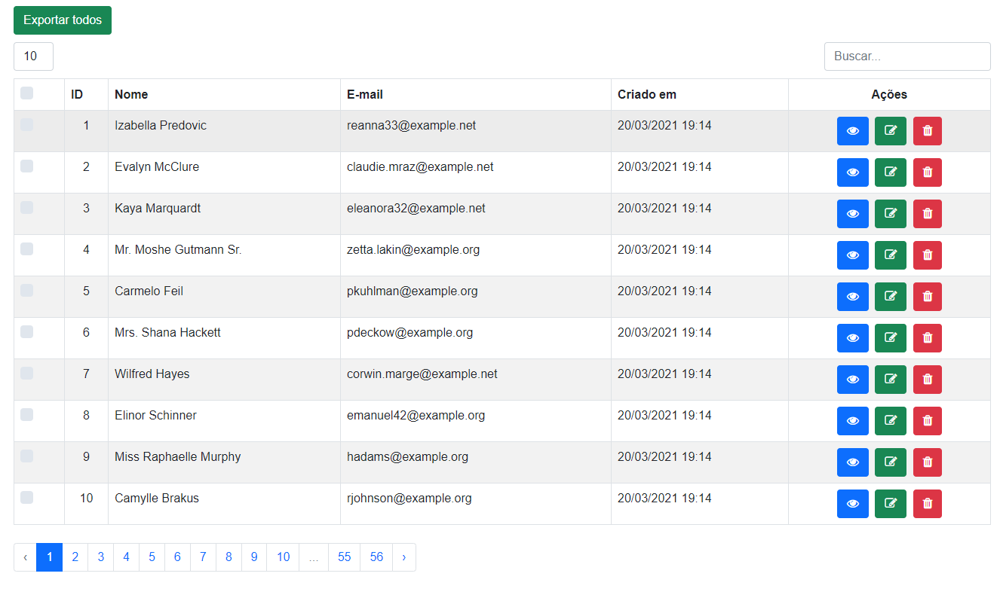
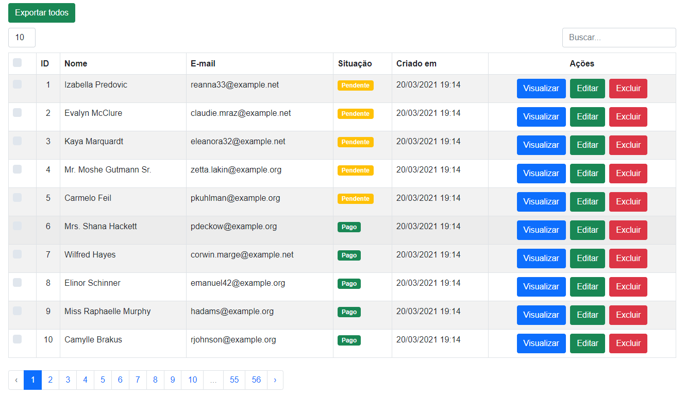

### Example 1 - button with fontawesome icon

    class UserTable extends DataTableComponent
    {
        use ActionButton;
    
        public function setUp()
        {
            $this->showCheckBox()
                ->showPerPage()
                ->showSearchInput();
        }
    
        public function dataSource(): User
        {
            return new User();
        }
    
        public function columns(): array
        {
            return [
                Column::add()
                    ->title('ID')
                    ->field('id')
                    ->searchable()
                    ->sortable()
                    ->className('text-center')
                    ->make(),
    
                Column::add()
                    ->title('Nome')
                    ->field('name')
                    ->searchable()
                    ->sortable()
                    ->make(),
    
                Column::add()
                    ->title('E-mail')
                    ->field('email')
                    ->searchable()
                    ->sortable()
                    ->make(),
    
                Column::add()
                    ->title('Criado em')
                    ->field('created_at')
                    ->searchable()
                    ->make(),
            ];
        }
    
        public function actions(): array
        {
            return [
                Button::add('view')
                    ->i('fa fa-eye', 'Visualizar')
                    ->class('btn btn-primary')
                    ->route('user.view', ['id' => 'id'])
                    ->make(),
    
                Button::add('edit')
                    ->i('fa fa-edit', 'Editar')
                    ->class('btn btn-success')
                    ->route('user.edit', ['id' => 'id'])
                    ->make(),
    
                Button::add('delete')
                    ->i('fa fa-trash', 'Excluir')
                    ->class('btn btn-danger')
                    ->route('user.edit', ['id' => 'id'])
                    ->make(),
            ];
        }
    
    }

### Example 2 - with custom html and simple button

    class UserTable extends DataTableComponent
    {
        use ActionButton;
    
        public function setUp()
        {
            $this->showCheckBox()
                ->showPerPage()                
                ->showSearchInput();
        }
    
        public function dataSource(): Collection
        {
            $user = User::query()->get();
            $data = DataTable::eloquent($user)
                ->addColumn('id', function(User $user) {
                    return $user->id;
                })
                ->addColumn('active', function(User $user) {
                    if ($user->id > 5) {
                        $active = 'Pago';
                    } else {
                        $active = 'Pendente';
                    }
                    return $active;
                })
                ->addColumn('name', function(User $user) {
                    return $user->name;
                })
                ->addColumn('email', function(User $user) {
                    return $user->name;
                })
                ->addColumn('created_at', function(User $user) {
                    return Carbon::parse($user->created_at)
                        ->setTimezone(new DateTimeZone('America/Sao_Paulo'))
                        ->format('d/m/Y H:i');
                })
                ->make();
    
            $this->isCollect();
            return new Collection($data);
    
        }
    
        public function columns(): array
        {
            return [
                Column::add()
                    ->title('ID')
                    ->field('id')
                    ->searchable()
                    ->sortable()
                    ->className('text-center')
                    ->make(),
    
                Column::add()
                    ->title('Nome')
                    ->field('name')
                    ->searchable()
                    ->sortable()
                    ->make(),
    
                Column::add()
                    ->title('E-mail')
                    ->field('email')
                    ->searchable()
                    ->sortable()
                    ->make(),
    
                Column::add()
                    ->title('Situação')
                    ->field('active')
                    ->searchable()
                    ->html()
                    ->make(),
    
                Column::add()
                    ->title('Criado em')
                    ->field('created_at')
                    ->searchable()
                    ->make(),
            ];
        }
    
        public function actions(): array
        {
            return [
                Button::add('view')
                    ->caption('Visualizar')
                    ->class('btn btn-primary')
                    ->route('user.view', ['id' => 'id'])
                    ->make(),
    
                Button::add('edit')
                    ->caption('Editar')
                    ->class('btn btn-success')
                    ->route('user.edit', ['id' => 'id'])
                    ->make(),
    
                Button::add('delete')
                    ->caption('Excluir')
                    ->class('btn btn-danger')
                    ->route('user.edit', ['id' => 'id'])
                    ->make(),
            ];
        }
    
    }
